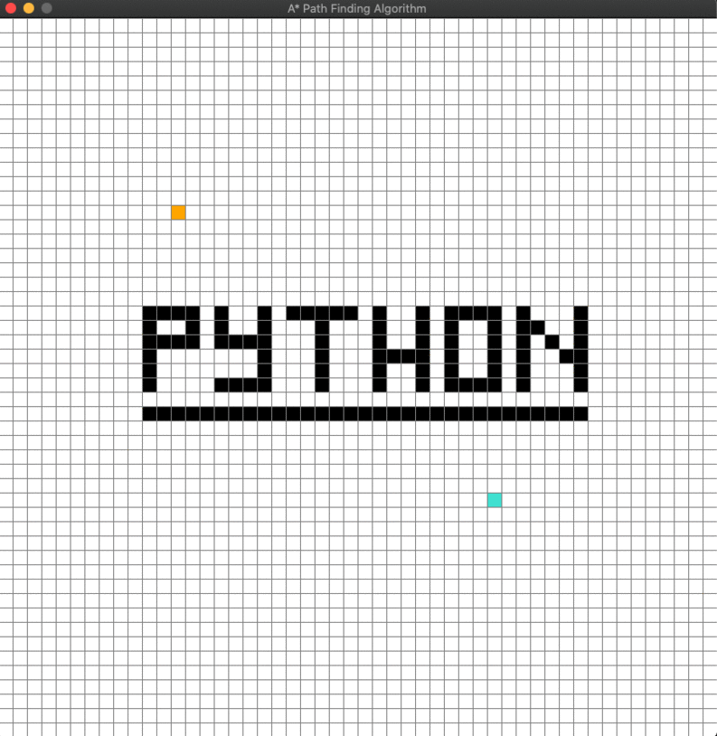

## Algo Visualizer - `pathfinder`
    - shortest path
    - A*

## *Instructions*:
1. `pipenv install` (mac users v2)
    - **install** dependencies: `pygame`
2. run "python astar.py" to load game
3. `note` - uses `PriorityQueue` to manage min g_scores
    - from queue module

## *Controls*:
- 1st `left mouse click` - draw start point
- 2nd `left mouse click` - draw end point
- `left mouse click` - draw barrier blocks
- `spacebar` - Start algorithm
- `right mouse click` - erase
- `X` - top left, close game
- `C` - clear whole board

##  -  *Have Fun!*

    Will be adding more soon, need to keep studying python! 